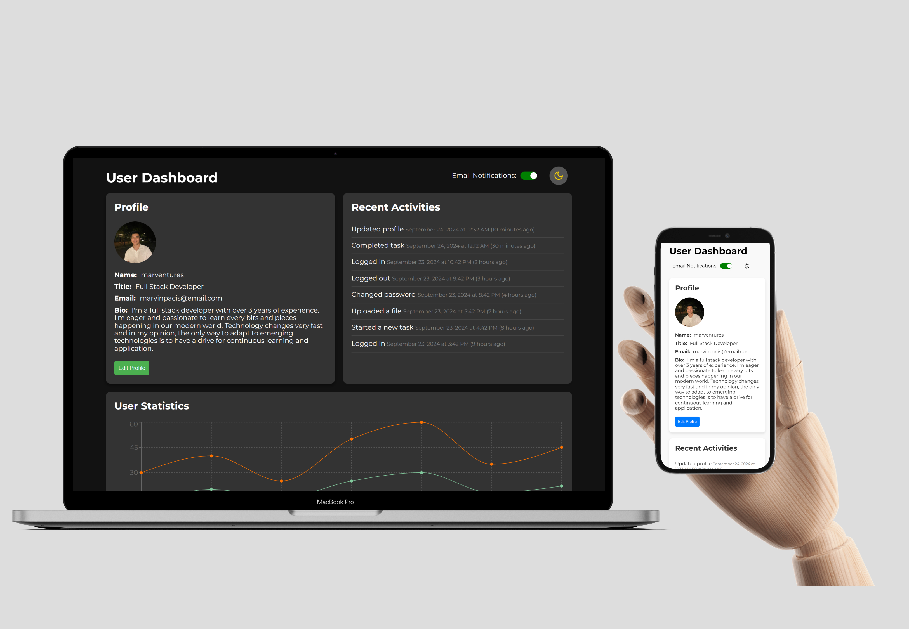
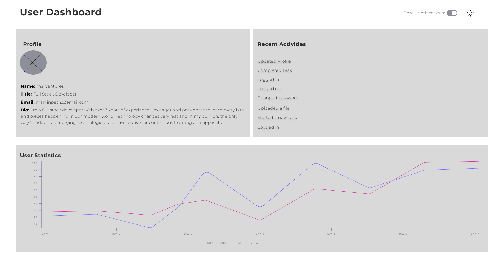

# User Dashboard Application

This repository contains the frontend code for a user dashboard application. It provides a user interface for managing user profiles, activities, and statistics.

## Table of Contents

- [Project Overview](#project-overview)
  - [Screenshot](#screenshot)
  - [Wireframes](#wireframes)
  - [Links](#links)
- [Usage](#usage)
  - [Prerequisites](#prerequisites)
  - [Installation](#installation)
  - [Commands](#commands)
- [Built With](#built-with)
- [Author](#author)

## Project Overview

This project is a frontend application designed to manage user information and display user statistics. It provides a seamless user experience for managing profiles and activities.

### Screenshot

- 

### Wireframes

- 

### Links

- [Live Link](https://user-dashboard-seven-iota.vercel.app/)

## Usage

### Prerequisites

Before you begin, ensure you have Node.js installed on your local machine.

### Installation

1. Clone the repository:

   ```bash
   git clone https://github.com/marventures/user-dashboard.git
   cd user-dashboard
   ```

2. Install dependencies:

   ```bash
   npm install
   ```

### Commands

- `npm start`: Starts the development server.
- `npm run build`: Builds the application for production.
- `npm test`: Runs eslint to check the code.
- `npm run eject`: Ejects the application configuration.

## Built With

### Core

- [React](https://react.dev/): A JavaScript library for building user interfaces.

### UI Components

- [Lucide React](https://lucide.dev/): A collection of beautiful, customizable icons.
- [Styled Components](https://styled-components.com/): A library for styling React components using tagged template literals.
- [Recharts](https://recharts.org/en-US/): A composable charting library built on React components.

## Author

- GitHub - [marventures](https://github.com/marventures)
- LinkedIn - [Marvin Morales Pacis](https://www.linkedin.com/in/marventures/)
